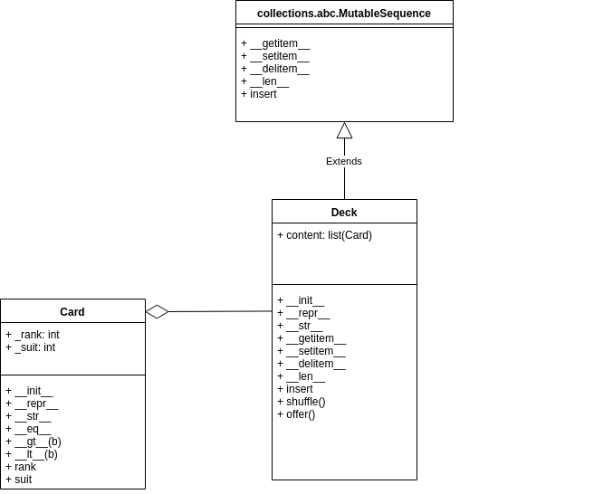

# Blackjack Game Design

[https://en.wikipedia.org/wiki/Blackjack](https://en.wikipedia.org/wiki/Blackjack)
> **Blackjack**  is the American variant of a globally popular banking game known as Twenty-One, whose relatives include 
Pontoon and Vingt-et-Un. It is a comparing card game between one or more players and a dealer, where each player in turn
 competes against the dealer. Players do not compete against each other. It is played with one or more decks of 52 cards
 , and is the most widely played casino banking game in the world. The objective of the game is to beat the dealer in
  one of the following ways:
>- Get 21 points on the player's first two cards (called a "blackjack" or "natural"), without a dealer blackjack;
>- Reach a final score higher than the dealer without exceeding 21; or
>- Let the dealer draw additional cards until their hand exceeds 21 ("busted").

## Rules

### Goal
- The Goal of blackjack is to beat the dealer's hand without going over 21.

### Value
| Card             | Value                     |
| ---------------- | ------------------------- |
| 2 to 10          | their pip value (2 to 10) |
| Face cards (JQK) | 10                        |
| Aces             | 1 or 11                   |

### Rule Details
- Each player starts with two cards, one of the dealer's cards is hidden until the end.
- To '**Hit**' is to ask for another card. To '**Stand**' is to hold your total and end your turn.
- If you go over 21 you bust, and the dealer wins regardless of the dealer's hand.
- If you are dealt 21 from the start (Ace & 10), you got a black jack.
- Black jack usually means you win 1.5 the amount of your bet. Depends on the casino.
- Dealer will hit until his/her cards total 17 or higher.
- Doubling is like a hit, only the bet is doubled and you only get one more card.
- Split can be done when you have two of the same card - the pair is split into two hands.
- Splitting also doubles the bet, because each new hand is worth the original bet.
- You can only double/split one the first move, or first move of a hand created by a split.
- You cannot play on two aces after they are split.
- You can double on a hand resulting from a split, tripling or quadrupling you bet.

## Card and Deck Object Design
**Class UML**

